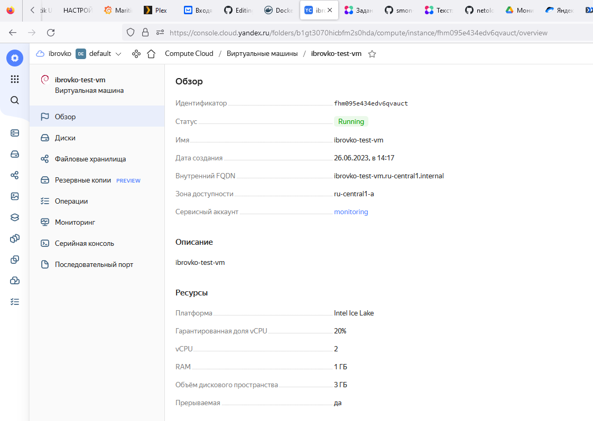

## Домашнее задание к занятию «Обзор систем IT-мониторинга» - Бровко И.Г.

---
 
### Задание 1

Создайте виртуальную машину в Yandex Compute Cloud и с помощью Yandex Monitoring создайте дашборд, на котором будет видно загрузку процессора.

#### Процесс выполнения
* Виртуальная машина в Yandex Cloud создана 
* 
* 
* Мой дашборд в Yandex Monitoring 
* 

---

### Задание 2 со звёздочкой*
*Это дополнительное задание. Его можно не выполнять. Это не повлияет на зачёт. Вы можете его выполнить, если хотите глубже разобраться в материале.*

* С помощью Yandex Monitoring сделал 2 алерта на загрузку процессора: WARN и ALARM, и создал уведомление по e-mail. 
