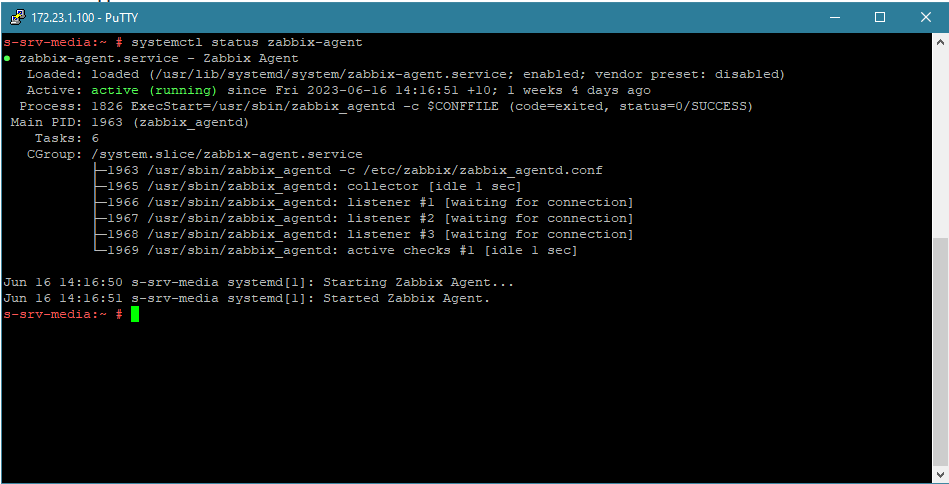

# Домашнее задание к занятию «Система мониторинга Zabbix»

### Задание 1 

* `У меня уже есть рабочий zabbix 6.2 +apache2+mysql который я полностью сконфигурировал под свои задачи,
но установлю zabbix 6.4 для выполнения ДЗ ради интереса дабы посмотреть изменения в версии 6.4`
* `И так установлю zabbix последней версии + postgresql + apache2 на заранее подготовленную ВМ IP 172.23.7.71`
* `Установливаю Zabbix Server с веб-интерфейсом. (Инструкция на оф сайте zabbix)`
* Список команд для установки 
* 
* 
* 

---

### Задание 2 

Установите Zabbix Agent на два хоста.

* `В своем рабочем "арсенале" , работабю сис админом, у меня уже есть рабочий zabbix сервер версии 6.2 + apache2 + mysql.`
* `Скриншоты возьму с рабочего zabbix сервера который я сконфигурировал а точнее апнул старенький zabbix 3.5 на 6.2 в прошлом году`
* и так, zabbix крутиться на ВМ,  IP 172.23.8.1 
* zabbix agent очень просто устанавливается на хосты по инструкции с сайта zabbix 
* Далее после установки необходимо сконфигурировать файл  /etc/zabbix/zabbix_agentd.conf , настроить агент на работу с zabbix сервером
* и так для примера возьму две машины одна физический сервер с ос OpenSUSE leap другая ВМ на ос Debian, приведу пример конфигурации zabbix agent файла zabbix_agentd.conf железного сервера s-srv-media
* 
* 
* 
* 
* Для того чтобы обеспечить свзяь агента zabbix  с сервером zabbix в файле zabbix_agentd.conf необходимо настроить несколько параметров
  1. В секции Option: SourceIP указать SourceIP= ip адрес для исходящих соединений
  2. В секции Option: Server указать Server= ip адрес zabbix сервера и при необходимости порт если используем отличный от дефолтного
  3. При необходимости так же можем настроить ServerActive= ip адрес zabbix сервера/proxy в секции Option: ServerActive
  4. перезапускаем zabbix агент systemctl restart zabbix-agent
* И так zabbix агент настроен, добавляем хост на мониторинг в zabbix сервер
* Для того чтобы добавить хост на мониторинг в zabbix сервер нужно создать группу а потом добавить хост в группу
* у меня это группа LInux servers и как раз таки в нее добавлены два хоста s-srv-media и s-unifi 
* 
* Необходимо настроить хост при добавлении на мониторинг указава ip агента (хоста) и порт(предлагается по умолчанию), а так же необходимо добавить шаблон длся опроса 
* ВМ s-unifi 
* Последние данные по добавленным хостам s-srv-media, s-unifi
* 
* 
---
## Задание 3 со звёздочкой*

Установите Zabbix Agent на Windows (компьютер) и подключите его к серверу Zabbix.

* И так скачиваем zabbix агент для windows с сайта zabbix (например архив с файлами), распаковываем и кладем на машину с windows например в C:\Program Files (x86)\zabbix
* По аналогии с настройкой на linux редактируем файл настроек zabbix агента zabbix_agentd.conf
  1. В секции Option: SourceIP указать SourceIP= ip адрес для исходящих соединений
  2. В секции Option: Server указать Server= ip адрес zabbix сервера и при необходимости порт если используем отличный от дефолтного
  3. При необходимости так же можем настроить ServerActive= ip адрес zabbix сервера/proxy в секции Option: ServerActive
  4. устанавливаем zabbix агент, zabbix_agentd.exe -c zabbix_agentd.conf -i, запускаем агента zabbix_agentd.exe --start
  5. у меня zabbix агент установлен на нескольких ВМ , для примера рассмотрим s-srv-sv
* 
* 
* 

--- 
