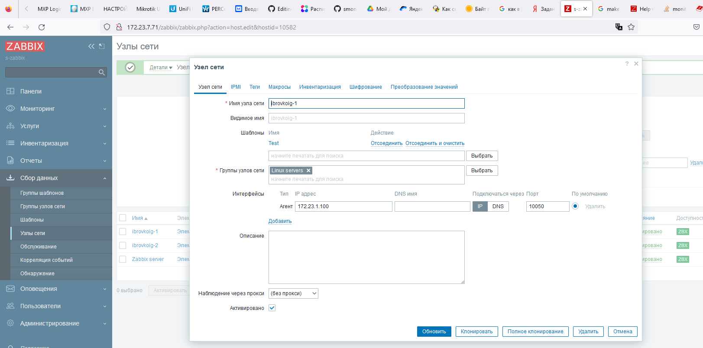

# Домашнее задание к занятию «Система мониторинга Zabbix. Часть 2»

 ---

### Задание 1
Создайте свой шаблон, в котором будут элементы данных, мониторящие загрузку CPU и RAM хоста.

#### Процесс выполнения
* Создаю свой шаблон
* Создаю 2 item которые будут собирать информцию об загрузке CPU и RAM в процентах, использую UserParameter в настройках агента на обеих машинах
* UserParameter=cpu, top -b -n1 | grep "Cpu(s)" | awk '{print $2+$4 } '
* UserParameter=ram, free | awk 'NR==2{printf "%.2f\n", ($3)/$2*100}'
* 
* 

 ---

### Задание 2 & Задание 3
* в Zabbix два хоста с именами ibrovkoig-1 и ibrovkoig-2 
* К хостам ibrovkoig-1 и ibrovkoig-2 добавлен мой шаблон Test
* Сначала для проверки добавим мой шаблон Test к ibrovkoig-1 
* Latest Data по шаблону Test хоста ibrovkoig-1 
* Добавим мой шаблон Test к ibrovkoig-2 
* Latest Data по шаблону Test хоста ibrovkoig-2 
* Теперь добавим к обоим хостам шаблон Linux by Zabbix agent
* Хост ibrovkoig-1 с двумя прикрепленными шаблонами 
* Хост ibrovkoig-2 с двумя прикрепленными шаблонами 
* Latest Data ibrovkoig-1 с двумя прикрепленными шаблонами 
* Latest Data ibrovkoig-2 с двумя прикрепленными шаблонами 
 ---

### Задание 4
* Создал свой дашборд 
