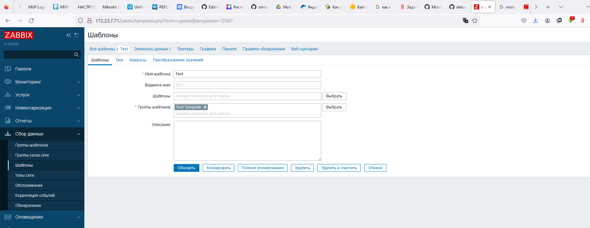

# Домашнее задание к занятию «Система мониторинга Zabbix. Часть 2»

 ---

### Задание 1
Создайте свой шаблон, в котором будут элементы данных, мониторящие загрузку CPU и RAM хоста.

#### Процесс выполнения
* Создаю свой шаблон
* Создаю 2 item которые будут собирать информцию об загрузке CPU и RAM в процентах, использую UserParameter в настройках агента на обеих машинах
* UserParameter=cpu, top -b -n1 | grep "Cpu(s)" | awk '{print $2+$4 } '
* UserParameter=ram, free | awk 'NR==2{printf "%.2f\n", ($3)/$2*100}'
* 
* 

 ---

### Задание 2 & Задание 3
* в Zabbix два хоста с именами ibrovkoig-1 и ibrovkoig-2 
* К хостам ibrovkoig-1 и ibrovkoig-2 добавлены 2 шаблона linux by zabbix agent и мой шаблон Test
* Добавим мой шаблон Test к ibrovkoig-1 
* Latest Data по шаблону Test хоста ibrovkoig-1 
* Добавим мой шаблон Test к ibrovkoig-2 
* Latest Data по шаблону Test хоста ibrovkoig-2 
 ---

### Задание 4
Создайте свой кастомный дашборд.

#### Процесс выполнения
1. Выполняя ДЗ сверяйтесь с процессом отражённым в записи лекции.
2. В разделе Dashboards создайте новый дашборд
3. Разместите на нём несколько графиков на ваше усмотрение.

#### Требования к результату
- [ ] Прикрепите в файл README.md скриншот дашборда с названием «Задание 4»

 ---

### Задание 5* со звёздочкой
Создайте карту и расположите на ней два своих хоста.

#### Процесс выполнения
1. Настройте между хостами линк.
2. Привяжите к линку триггер, связанный с agent.ping одного из хостов, и установите индикатором сработавшего триггера красную пунктирную линию.
3. Выключите хост, чей триггер добавлен в линк. Дождитесь срабатывания триггера.

#### Требования к результату
- [ ] Прикрепите в файл README.md скриншот карты, где видно, что триггер сработал, с названием «Задание 5» 

 ---

### Задание 6* со звёздочкой
Создайте UserParameter на bash и прикрепите его к созданному вами ранее шаблону. Он должен вызывать скрипт, который:
- при получении 1 будет возвращать ваши ФИО,
- при получении 2 будет возвращать текущую дату.

#### Требования к результату
- [ ] Прикрепите в файл README.md код скрипта, а также скриншот Latest data с результатом работы скрипта на bash, чтобы был виден результат работы скрипта при отправке в него 1 и 2
 
 ---

### Задание 7* со звёздочкой
Доработайте Python-скрипт из лекции, создайте для него UserParameter и прикрепите его к созданному вами ранее шаблону. 
Скрипт должен:
- при получении 1 возвращать ваши ФИО,
- при получении 2 возвращать текущую дату,
- делать всё, что делал скрипт из лекции.

- [ ] Прикрепите в файл README.md код скрипта в Git. Приложите в Git скриншот Latest data с результатом работы скрипта на Python, чтобы были видны результаты работы скрипта при отправке в него 1, 2, -ping, а также -simple_print.*
 
 ---

### Задание 8* со звёздочкой

Настройте автообнаружение и прикрепление к хостам созданного вами ранее шаблона.

#### Требования к результату
- [ ] Прикрепите в файл README.md скриншот правила обнаружения, а также скриншот страницы Discover, где видны оба хоста.*

 ---

### Задание 9* со звёздочкой

Доработайте скрипты Vagrant для 2-х агентов, чтобы они были готовы к автообнаружению сервером, а также имели на борту разработанные вами ранее параметры пользователей.

- [ ] Приложите в GitHub файлы Vagrantfile и zabbix-agent.sh.*

## Критерии оценки

1. Выполнено минимум 4 обязательных задания
2. Прикреплены требуемые скриншоты, код и файлы 
3. Задание оформлено в шаблоне с решением и опубликовано на GitHub

