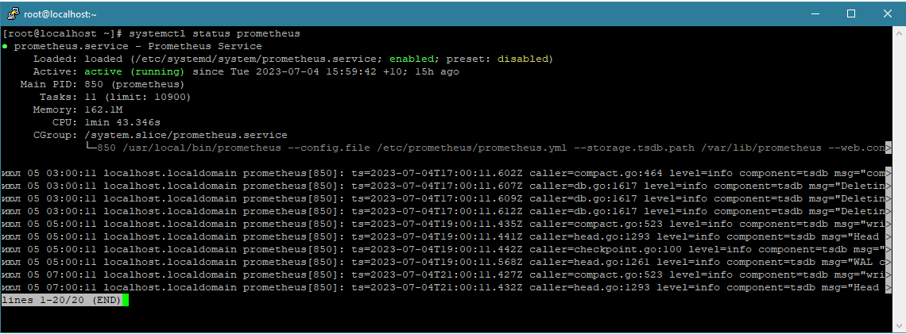
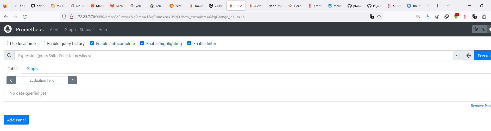
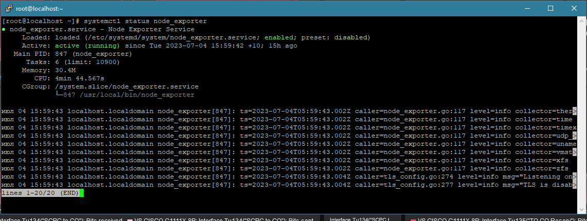
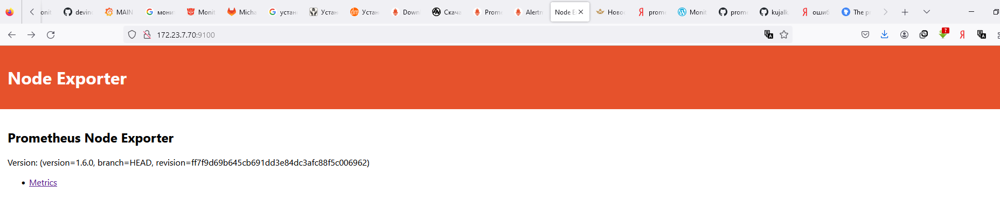
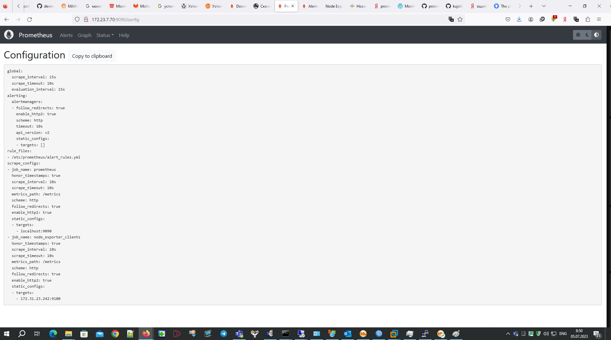
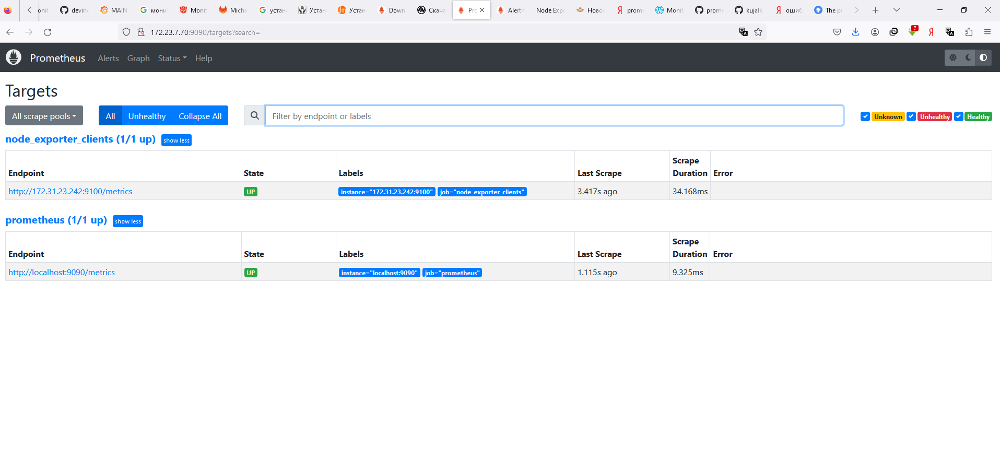
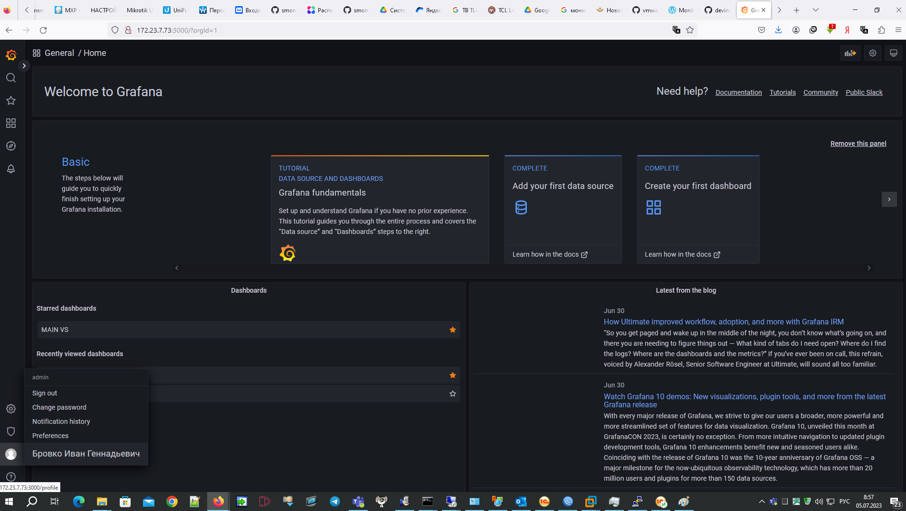
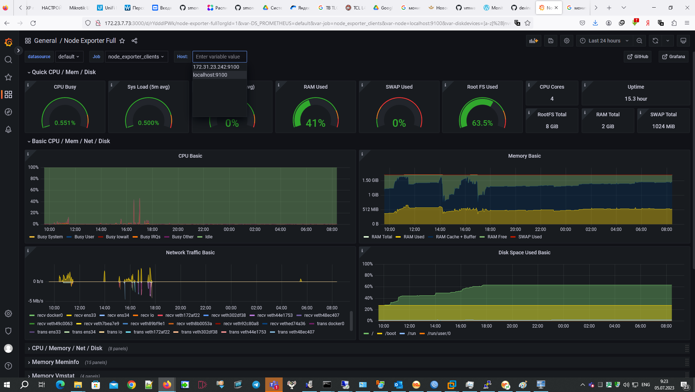

# Домашнее задание к занятию «Система мониторинга Prometheus» - Бровко И.Г.

---

### Задание 1
Установите Prometheus.

* Prometheus Установлен, пользователь создан, сервис и автозапуск создан.
* prometheus.service — Prometheus Service Netology Lesson 9.4 — Бровко И.Г. 
* 

---

### Задание 2
Установите Node Exporter.

* Node Exporter установлен, сервис и автозапуск создан.
* node-exporter.service — Node Exporter Netology Lesson 9.4 — Бровко И.Г. 
* 

---

### Задание 3
Подключите Node Exporter к серверу Prometheus.

* Подключаю Node Exporter к серверу Prometheus.
* Добавлю два таргета в prometheus.yaml, собственно сам сервер prometheus и дополнительно установил Node Exporter на VM1
* Prometheus вкладка Status > Configuration 
* Prometheus вкладки Status > Targets 

---
## Дополнительные задания со звёздочкой*
Эти задания дополнительные. Их можно не выполнять. Это не повлияет на зачёт. Вы можете их выполнить, если хотите глубже разобраться в материале.

---

### Задание 4*
Установите Grafana.

* Grafana установлена 

---

### Задание 5*
Интегрируйте Grafana и Prometheus.

* Добавляем в Grafana шаблон Node exporter full 
* Как видно из скриншота данный поступают 
