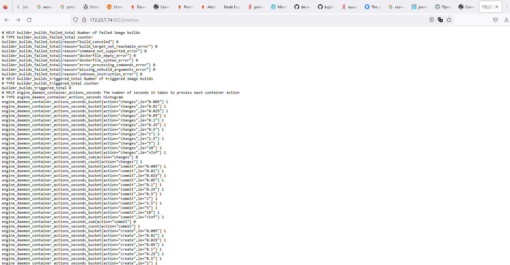
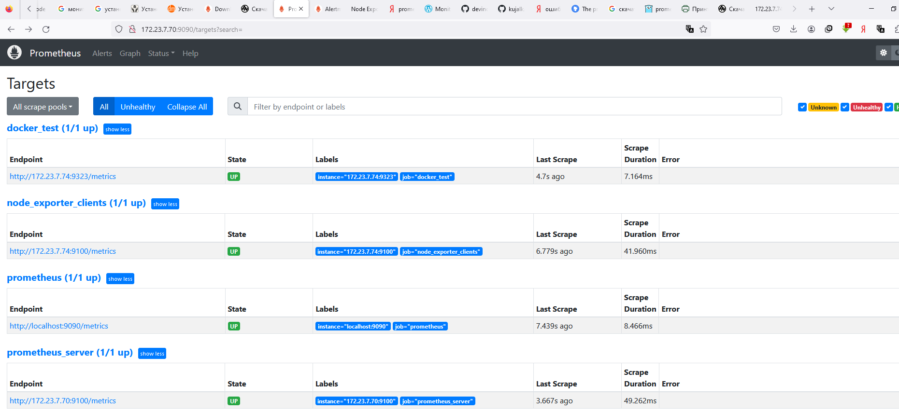
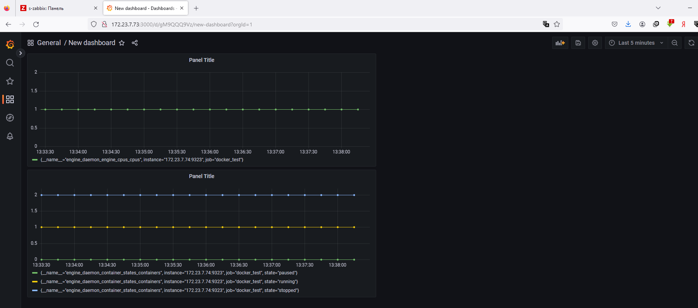

# Домашнее задание к занятию «Prometheus. Часть 2»

---

### Задание 1
Создайте файл с правилом оповещения, как в лекции, и добавьте его в конфиг Prometheus.
* создаю файл с правилом оповещения 
* на одном из хостов выключаю node exporter, стоящий на мониторинге 
* хост в статусе Pending 

---

### Задание 2
Установите Alertmanager и интегрируйте его с Prometheus.

* Alertmanager установлен и интегрирован с Prometheus.
* 

---

### Задание 3

Активируйте экспортёр метрик в Docker и подключите его к Prometheus.
* скриншот браузера с открытым эндпоинтом из docker 
* скриншот списка таргетов из интерфейса Prometheus 

---

### Задание 4* со звездочкой 

Создайте свой дашборд Grafana с различными метриками Docker и сервера, на котором он стоит.
* 
* Будет гораздо информативнее если установить cAdvisor
